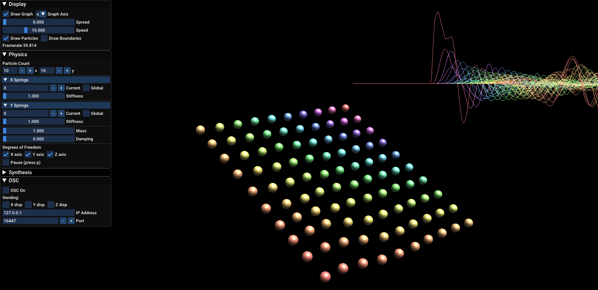

# CHON

CHON (Coupled Harmonic Oscillator Network) is a new real-time, interactive, cross-platform application for composing tactile sonic gestures and textures based in Newtonian physics. It simulates a network of particles connected by spring-like forces and sonifies the motion of individual particles. The user sets the system into motion by displacing a particle, which causes a chain reaction governed by Newtonian mechanics. With this interactivity, CHON can provide complex yet tangible and physically grounded control data for synthesis, sound processing, and musical score generation. The user can also intervene in the evolving system, dragging and moving particles at will. 

Composers often deploy dozens of independent LFOs to control various parameters in a DAW or synthesizer. By coupling numerous control signals together using physical principles, CHON represents an innovation on the traditional LFO model of musical control. Unlike independent LFOs, CHON's signals push and pull on each other, creating a tangible causality in the resulting gestures.

The visual interface is a 3D rendering of the particle system. The user interacts directly with the particles in the visual simulation using a computer mouse. A 2D graph can also be displayed which visualizes the displacement of each particle along a given axis. The instrument generates a stream of OSC data from each particle, making it a versatile tool for generating up to hundreds of control signals that are linked by physical laws.

The application is written in C++ using the Allolib Framework.

# Building

## CHECK THE RELEASES PAGE FOR A COMPILED VERSION FOR YOUR OPERATING SYSTEM (https://github.com/rodneydup/CHON/releases)

### If you can't find one, or if you want to try compiling it yourself, follow the instructions below.

## Dependencies

terminal to run bash

git

cmake version 3.0 or higher

## How to setup
On a bash shell:

    git clone https://github.com/rodneydup/CHON
    cd CHON
    ./configure.sh
    ./run.sh

This will compile the project, and run the binary if compilation is successful.
